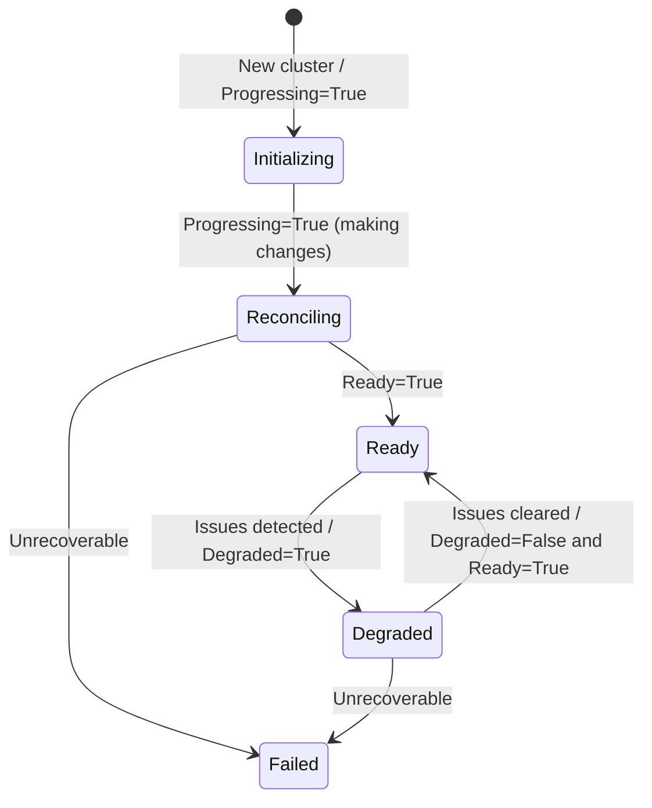

# ValkeyCluster status conditions


The `ValkeyCluster` custom resource uses its `status` field to provide detailed feedback about the current state of the Valkey cluster. This document explains the different fields and conditions you can use to monitor and understand the health of cluster.

## Status fields

These top-level fields in `.status` provide a high-level, human-readable summary of the cluster's state.

- **`state`**: A single word that summarizes the overall condition of the cluster. The possible values are:
  - `Initializing`: The cluster is being created for the first time.
  - `Reconciling`: The operator is actively working to bring the cluster to its desired state (e.g., scaling, updating, or recovering).
  - `Ready`: The cluster is healthy, fully functional, and serving traffic.
  - `Degraded`: The cluster is at least partially functional but is in an unhealthy state (e.g., a primary is down, not all replicas are available).
  - `Failed`: The operator has encountered a persistent error and cannot reach the desired state.

- **`reason`**: A machine-readable, `CamelCase` string that provides a brief explanation for the current `state`.

- **`message`**: A detailed, human-readable message explaining the current state.

- **`shards`**: The number of shards currently detected in the Valkey cluster.

- **`readyShards`**: The number of shards that are fully healthy, meaning they have a primary and the desired number of replicas.

---

## Conditions array (`status.conditions[]`)

`conditions[]` follows the standard Kubernetes `metav1.Condition` format:

- **type**: condition name (e.g., `Ready`, `Progressing`)
- **status**: `True`, `False`, or `Unknown`
- **reason**: short machine-readable code (stable)
- **message**: human-readable explanation
- **lastTransitionTime**: time when the condition last changed
- **observedGeneration**: the resource generation the controller observed when setting the condition

---

## Condition types

### Standard conditions

#### `Ready`
Indicates whether the cluster is fully functional and serving traffic.

| Status | Meaning |
|---|---|
| `True` | All shards exist with correct number of nodes, **cluster is healthy**, and topology is complete. |
| `False` | Initial creation, topology changes needed, missing shards/replicas, or infrastructure errors. |

Common reasons when `Ready=False`:
- `ServiceError` – failed to create/update headless service
- `ConfigMapError` – failed to create/update configuration
- `DeploymentError` – failed to create/update deployments
- `PodListError` – failed to list pods
- `Reconciling` – controller is making changes
- `MissingShards` – waiting for all shards to be created
- `MissingReplicas` – waiting for all replicas to be created

Common reasons when `Ready=True`:
- `ClusterHealthy` – Cluster is healthy

#### `Progressing`
Indicates whether the cluster is being created, updated, or scaled.

| Status | Meaning |
|---|---|
| `True` | Reconciliation in progress (creating resources, adding nodes, etc.). |
| `False` | Cluster matches desired state and is stable. |

Common reasons:
- `Initializing` – initial cluster creation
- `Reconciling` – general reconciliation in progress
- `AddingNodes` – adding nodes to the cluster
- `ReconcileComplete` – reconciliation finished (typically with `status=False`)

#### `Degraded`
Indicates whether the cluster is impaired but may still be partially functional.

| Status | Meaning |
|---|---|
| `True` | Cluster has issues but may still serve traffic. |
| `False` (or absent) | Cluster is not degraded. |

Common reasons:
- `NodeAddFailed` – failed to add a node to the cluster
- `PrimaryLost` – primary lost in one or more shards
- `NoSlotsAvailable` – no unassigned slots available for new shard

---

### Valkey-specific conditions

#### `ClusterFormed`
Indicates whether all nodes have joined the cluster and meet the desired shard/replica layout.

| Status | Meaning |
|---|---|
| `True` | All shards and replicas are present and joined. |
| `False` | Pending nodes, missing shards, or missing replicas. |

Typical reasons:
- `ClusterFormed` – Cluster is formed
- `MissingShards` – waiting for shards
- `MissingReplicas` – waiting for replicas

#### `SlotsAssigned`
Indicates whether all **16384** hash slots are assigned to primaries.

| Status | Meaning |
|---|---|
| `True` | All slots are assigned. |
| `False` | Some slots remain unassigned. |

Common reasons:
- `AllSlotsAssigned` – all 16384 slots are assigned
- `SlotsUnassigned` – waiting for slots to be assigned

---

## State transitions

The high-level `state` is derived from conditions (priority order):

1. `Degraded=True` → `state=Degraded`
2. `Ready=True` → `state=Ready`
3. `Progressing=True` and cluster already has shards → `state=Reconciling`
4. `Progressing=True` and new cluster (no shards yet) → `state=Initializing`
5. `Ready=False` with no other stronger signal → `state=Failed`

### Visual flow



---

## Monitoring status

### Quick status check

```bash
kubectl get valkeycluster
# or
kubectl get vkc
```

### Detailed status

```bash
# Describe including conditions
kubectl describe valkeycluster my-cluster

# Full YAML
kubectl get valkeycluster my-cluster -o yaml

# Query a specific condition
kubectl get valkeycluster my-cluster -o jsonpath='{.status.conditions[?(@.type=="Ready")]}'
```

---

## Example status outputs

### Healthy cluster

```yaml
status:
  state: Ready
  reason: ClusterHealthy
  message: Cluster is healthy
  shards: 3
  readyShards: 3
  conditions:
  - type: Ready
    status: "True"
    reason: ClusterHealthy
    message: Cluster is healthy
    lastTransitionTime: "2025-12-19T10:00:00Z"
    observedGeneration: 1
  - type: Progressing
    status: "False"
    reason: ReconcileComplete
    message: No changes needed
    lastTransitionTime: "2025-12-19T10:00:00Z"
    observedGeneration: 1
  - type: ClusterFormed
    status: "True"
    reason: TopologyComplete
    message: Cluster is formed
    lastTransitionTime: "2025-12-19T09:59:45Z"
    observedGeneration: 1
  - type: SlotsAssigned
    status: "True"
    reason: AllSlotsAssigned
    message: All slots assigned
    lastTransitionTime: "2025-12-19T09:59:45Z"
    observedGeneration: 1
```

### Initializing cluster

```yaml
status:
  state: Initializing
  reason: Reconciling
  message: Creating shards
  shards: 0
  readyShards: 0
  conditions:
  - type: Ready
    status: "False"
    reason: MissingShards
    message: Waiting for all shards to be created
    lastTransitionTime: "2025-12-19T10:00:00Z"
    observedGeneration: 1
  - type: Progressing
    status: "True"
    reason: Reconciling
    message: Creating shards
    lastTransitionTime: "2025-12-19T10:00:00Z"
    observedGeneration: 1
  - type: ClusterFormed
    status: "False"
    reason: MissingShards
    message: Waiting for shards
    lastTransitionTime: "2025-12-19T10:00:00Z"
    observedGeneration: 1
```

### Degraded cluster

```yaml
status:
  state: Degraded
  reason: NodeAddFailed
  message: "Failed to add node: connection timeout"
  shards: 2
  readyShards: 2
  conditions:
  - type: Ready
    status: "False"
    reason: Reconciling
    message: Cluster is reconciling
    lastTransitionTime: "2025-12-19T10:00:00Z"
    observedGeneration: 1
  - type: Progressing
    status: "True"
    reason: AddingNodes
    message: Adding nodes to cluster
    lastTransitionTime: "2025-12-19T10:00:00Z"
    observedGeneration: 1
  - type: Degraded
    status: "True"
    reason: NodeAddFailed
    message: "Failed to add node: connection timeout"
    lastTransitionTime: "2025-12-19T10:00:05Z"
    observedGeneration: 1
```


---

## Sample: `kubectl describe vkc valkeycluster-sample`

Below is an example of `kubectl describe` output for a healthy 3-shard cluster with 1 replica per shard. (`k` is a common `kubectl` alias.)

```text
k describe vkc valkeycluster-sample
Name:         valkeycluster-sample
Namespace:    default
Labels:       <none>
Annotations:  <none>
API Version:  valkey.io/v1alpha1
Kind:         ValkeyCluster
Metadata:
  Creation Timestamp:  2025-12-19T06:07:10Z
  Generation:          1
  Resource Version:    108933
  UID:                 7b60e0f4-2842-4929-bc94-3fa3cfb1dfa5
Spec:
  Replicas:  1
  Shards:    3
Status:
  Conditions:
    Last Transition Time:  2025-12-19T06:07:21Z
    Message:               No changes needed
    Observed Generation:   1
    Reason:                ReconcileComplete
    Status:                False
    Type:                  Progressing
    Last Transition Time:  2025-12-19T06:07:21Z
    Message:               Cluster is healthy
    Observed Generation:   1
    Reason:                ClusterHealthy
    Status:                True
    Type:                  Ready
    Last Transition Time:  2025-12-19T06:07:21Z
    Message:               Cluster is formed
    Observed Generation:   1
    Reason:                ClusterFormed
    Status:                True
    Type:                  ClusterFormed
    Last Transition Time:  2025-12-19T06:07:21Z
    Message:               All slots assigned
    Observed Generation:   1
    Reason:                AllSlotsAssigned
    Status:                True
    Type:                  SlotsAssigned
  Message:                 Cluster is healthy
  Ready Shards:            3
  Reason:                  ClusterHealthy
  Shards:                  3
  State:                   Ready
Events:                    <none>
```

### How to read it

- **Summary**
  - `State: Ready` + `Reason: ClusterHealthy` + `Message: Cluster is healthy` → cluster is serving normally.
  - `Shards: 3` and `Ready Shards: 3` → all shards are formed and healthy.

- **Conditions**
  - `Progressing=False (ReconcileComplete)` → controller is not actively changing anything.
  - `Ready=True (ClusterHealthy)` → cluster is fully functional.
  - `ClusterFormed=True (ClusterFormed)` → nodes have joined and match the requested topology (`spec.shards=3`, `spec.replicas=1`).
  - `SlotsAssigned=True (AllSlotsAssigned)` → all 16384 hash slots are assigned.

- **Observed Generation**
  - `Observed Generation: 1` on all conditions means status reflects **Generation 1** of the spec (i.e., the latest desired configuration at the time).

---

## Sample: `kubectl get vkc -A -o wide -w` (watch)

The watch output below shows how `state` and `reason` evolve during creation:

```text
k get vkc -A -o wide -w
NAMESPACE   NAME                   STATE          REASON           READYSHARDS   AGE
default     valkeycluster-sample   Initializing   Reconciling      0             0s
default     valkeycluster-sample   Reconciling    Reconciling      0             0s
default     valkeycluster-sample   Reconciling    AddingNodes      0             2s
default     valkeycluster-sample   Reconciling    AddingNodes      0             2s
default     valkeycluster-sample   Reconciling    AddingNodes      0             4s
default     valkeycluster-sample   Reconciling    AddingNodes      0             6s
default     valkeycluster-sample   Reconciling    AddingNodes      1             11s
default     valkeycluster-sample   Reconciling    AddingNodes      2             11s
default     valkeycluster-sample   Ready          ClusterHealthy   3             11s
default     valkeycluster-sample   Ready          ClusterHealthy   3             12m
```

### What this indicates

- **Initializing → Reconciling**
  - `Initializing` is the **initial state** for a new cluster before reconciliation begins.
  - Transition to `Reconciling` means reconciliation has begun.

- **Reconciling (AddingNodes)**
  - `Reason=AddingNodes` indicates the controller is actively joining pods to the Valkey cluster.
  - `READYSHARDS` increases (0 → 1 → 2 → 3) as shards become fully healthy.

- **Ready (ClusterHealthy)**
  - Once `READYSHARDS` reaches the desired shard count and the cluster is healthy, the summary switches to `Ready / ClusterHealthy`.
