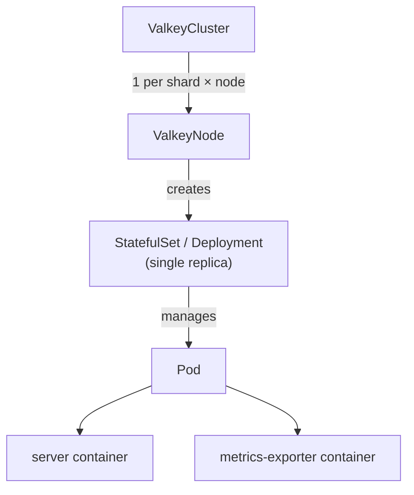

# ValkeyCluster

`ValkeyCluster` deploys Valkey in [Cluster mode](https://valkey.io/topics/cluster-tutorial/), handling:

- Topology scheduling
- Slot allocation
- Failovers
- Rolling updates
- ACLs

## Features

- [Config](#config)
- [Containers](#containers)
- [Metrics](#metrics)
- [Persistence](#persistence)
- [Pod disruption budget](#pod-disruption-budget)
- [Private image registries](#private-image-registries)
- [Scheduling](#scheduling)
- [TLS](#tls)
- [Users](#users)
- [Workload type](#workload-type)

### Config

```yaml
config:
  io-threads: 4
  maxmemory-policy: noeviction
```

Use `config` to pass [Valkey configuration](https://valkey.io/topics/valkey.conf/) to all nodes in the cluster.

Listed below are configurations can be applied live without rolling pods. We are adopting configs that can be applied live on a case-by-case basis. For any requests please [raise an issue](https://github.com/valkey-io/valkey-operator/issues/new).

```
maxclients
maxmemory         # There are no safeguards, ensure you do not exceed your container capacity
maxmemory-policy
```

#### Constraints

- Cluster management settings owned by the operator cannot be overwritten

#### Future plans

- Operator validates configs before they are applied to the server
  - https://github.com/valkey-io/valkey-operator/issues/141#issuecomment-4269559003

### Containers

```yaml
containers:
  - name: server
    env:
      - name: MY_VAR
        value: "example"
  - name: my-sidecar
    image: busybox:latest
    command: ["sh", "-c", "sleep infinity"]
```

`containers` patches the pod's container list using strategic merge patch. Containers named `server` or `metrics-exporter` are merged by name; anything else is appended as a sidecar.

### Metrics

```yaml
exporter:
  enabled: true   # default
  image: oliver006/redis_exporter:v1.80.0
  resources:
    requests:
      memory: "64Mi"
      cpu: "50m"
```

Each pod runs a `metrics-exporter` sidecar by default, exposing Prometheus metrics on port `9121`. To disable it:

```yaml
exporter:
  enabled: false
```

### Persistence

```yaml
persistence:
  size: 10Gi
  storageClassName: gp3
  reclaimPolicy: Retain
```

When `persistence` is set, the operator manages a PVC for each ValkeyNode. With the [save config option](https://valkey.io/topics/persistence/), memory state survives pod rolls and [partial resyncs](https://valkey.io/topics/replication/) are possible.

`Retain` keeps the PVC when a ValkeyNode is deleted; `Delete` removes it.

#### Constraints

- Only supported with `workloadType: StatefulSet`
- Cannot be added or removed after creation
- Size can only grow
- `storageClassName` is immutable

#### Future plans

- Live volume expansion
- Automated volume expansion

### Pod disruption budget

```yaml
podDisruptionBudget:
  mode: Cluster  # default
```

The operator creates a `PodDisruptionBudget` with `maxUnavailable: 1` selecting all pods in the cluster. Set `mode: Disabled` when the PDB is managed externally or is not required. Omitting `podDisruptionBudget` entirely is equivalent to `mode: Cluster`.

| Mode | Behaviour |
|---|---|
| `Cluster` | Operator creates and owns a single cluster-wide PDB |
| `Disabled` | Operator deletes the PDB if it exists and does not recreate it |

### Graceful shutdown

On `SIGTERM` (a node drain, eviction, or preemption), a cluster primary fails its slots over to a replica before exiting, so descheduling a primary the operator did not initiate does not leave the shard without a writer. This is enabled by default through the `shutdown-on-sigterm failover` server config and requires Valkey 9.0+.

The handoff runs inside the pod's termination grace period. With defaults there is comfortable margin: the Kubernetes default `terminationGracePeriodSeconds` is 30s and the Valkey default `cluster-manual-failover-timeout` is 5s, so the failover completes well before `SIGKILL`. If you raise `cluster-manual-failover-timeout`, the operator raises the derived `terminationGracePeriodSeconds` to match; see [Termination grace period](#termination-grace-period).

### Termination grace period

```yaml
terminationGracePeriodSeconds: 60
```

`terminationGracePeriodSeconds` sets the pod termination grace period for the Valkey nodes. On `SIGTERM` a primary gracefully fails its slots over to a replica, and that handover has to finish before Kubernetes sends `SIGKILL`, so the grace period must be at least `cluster-manual-failover-timeout` plus some headroom.

When omitted, the operator picks a safe value: the larger of the Kubernetes default (30s) and `cluster-manual-failover-timeout` (default 5s) plus a 10s buffer. With defaults that stays at 30s. Raising `cluster-manual-failover-timeout` pulls the derived grace period up with it.

An explicit value is honoured as-is, even if it is below the recommended minimum. In that case the operator sets a `ConfigurationWarning` condition (reason `GracePeriodTooShort`) on the `ValkeyCluster` and emits an event when the cluster first enters that state, rather than silently overriding the value. The value must be a positive integer; the CRD rejects zero or negative values.

### Private image registries

```yaml
image: registry.example.com/valkey/valkey:9.0.0
imagePullSecrets:
  - name: registrycredential
```

`imagePullSecrets` is a list of `Secret` references (in the cluster's namespace) used to pull images from private registries. It is applied at the pod level, so a single list covers every image in the pod - the Valkey server, the metrics exporter sidecar, and any additional containers. It is optional and has no default; omit it when the nodes already authenticate to the registry.

### Scheduling

```yaml
scheduling:
  tolerations:
    - key: "dedicated"
      operator: "Equal"
      value: "valkey"
      effect: "NoSchedule"
  nodeSelector:
    kubernetes.io/arch: amd64
  affinity:
    podAntiAffinity:
      requiredDuringSchedulingIgnoredDuringExecution:
        - labelSelector:
            matchLabels:
              app.kubernetes.io/name: valkey
          topologyKey: kubernetes.io/hostname
  priorityClassName: high-priority
```

`scheduling.tolerations`, `scheduling.nodeSelector`, `scheduling.affinity`, and `scheduling.priorityClassName` are passed through to every pod in the cluster. `priorityClassName` must reference an existing [PriorityClass](https://kubernetes.io/docs/concepts/scheduling-eviction/pod-priority-preemption/) and protects the Valkey pods from eviction under resource pressure.

#### Topology spread constraints

`topologySpreadConstraints` is a raw escape hatch: whatever you set is rendered **verbatim** onto every Valkey pod in the cluster. The operator does not scope, augment, or shard-index it, and adds no constraints of its own by default.

> **You must supply your own `labelSelector`.** A topology spread constraint with no `labelSelector` matches *nothing* — Kubernetes counts zero pods and the constraint enforces nothing (a silent no-op).
>
> Set a `labelSelector` that selects the pods you want counted; `valkey.io/cluster: <cluster-name>` selects every pod in the cluster.

For the common intents such as keep a shard's pods on different nodes, spread each shard's primary across nodes, or spread all pods across nodes — prefer [`scheduling.node.spread`](#node-axis-spread) below. It fills in the correct label selectors for you and guarantees the constraints it emits don't collide. Reach for `topologySpreadConstraints` only when you need something `node.spread` doesn't express, such as a different `topologyKey` (for example zone spreading).

> **Do not overlap a hostname constraint with `node.spread`.**
>
> A passthrough constraint on `topologyKey: kubernetes.io/hostname` collides with an enabled `node.spread.primaries` or `node.spread.pods` that renders the same `whenUnsatisfiable` (`Required` → `DoNotSchedule`, `Preferred` → `ScheduleAnyway`), because the pod would carry two constraints sharing that `{topologyKey, whenUnsatisfiable}` pair — which Kubernetes forbids.
>
> The operator rejects this combination at admission, so keep hostname spreading in `node.spread` and reserve `topologySpreadConstraints` for other topology keys (for example zones). A passthrough hostname constraint whose `whenUnsatisfiable` differs from what the enabled dimensions render is still allowed.

Each constraint must include:

| Field | Meaning |
|---|---|
| `maxSkew` | Maximum allowed difference in matching pod count between topology domains. `1` means Kubernetes keeps the matching pods as evenly spread as possible. |
| `topologyKey` | Node label used as the spread domain. Use `kubernetes.io/hostname` for worker-node spreading, or labels such as `topology.kubernetes.io/zone` for zone spreading. |
| `labelSelector` | Which pods to count. Required for the constraint to do anything (see note above). |
| `whenUnsatisfiable` | What Kubernetes should do when the constraint cannot be satisfied. |

`whenUnsatisfiable` supports:

| Value | Behaviour | Impact |
|---|---|---|
| `DoNotSchedule` | Hard rule. Kubernetes will not schedule the pod if placement would violate the constraint. | Stronger placement guarantees, but pods may remain `Pending` when there are not enough eligible nodes or topology domains. The operator marks the cluster `Degraded` with reason `PodUnschedulable`. |
| `ScheduleAnyway` | Soft rule. Kubernetes prefers satisfying the constraint, but can still schedule the pod if it cannot. | Better scheduling availability in constrained clusters, but matching pods may still share a topology domain. |

Example — spread every pod in the cluster across availability zones, preferring but not requiring an even distribution:

```yaml
scheduling:
  topologySpreadConstraints:
    - maxSkew: 1
      topologyKey: topology.kubernetes.io/zone
      whenUnsatisfiable: ScheduleAnyway
      labelSelector:
        matchLabels:
          valkey.io/cluster: my-cluster
```

Switch `whenUnsatisfiable` to `DoNotSchedule` to make it a hard rule; pods that cannot be placed within `maxSkew` then stay `Pending` rather than colocating.

#### Node axis spread

```yaml
scheduling:
  node:
    spread:
      shard:
        mode: Preferred
      primaries:
        mode: Disabled
      pods:
        mode: Disabled
```

`scheduling.node.spread` groups three independent spread dimensions, each keyed on `kubernetes.io/hostname`, so you get shard- and primary-aware placement without hand-writing label selectors:

| Field | Rendered as | Effect |
|---|---|---|
| `shard` | Pod anti-affinity | Keeps pods belonging to the same shard, for example a primary and its replica, off the same node. |
| `primaries` | Topology spread constraint on each shard's node-index-0 pod | Spreads the pod that holds each shard's primary (at creation) across nodes. |
| `pods` | Topology spread constraint on every cluster pod | Spreads all of the cluster's pods across nodes, regardless of shard. |

Each field takes a `mode`:

| Mode | Behaviour |
|---|---|
| `Disabled` | Emits nothing for that dimension. This is the default for all three fields. |
| `Preferred` | Soft rule: a `preferredDuringSchedulingIgnoredDuringExecution` anti-affinity term (`shard`), or a topology spread constraint with `whenUnsatisfiable: ScheduleAnyway` (`primaries`, `pods`). Kubernetes biases placement but never leaves a pod `Pending` because of it. |
| `Required` | Hard rule: a `requiredDuringSchedulingIgnoredDuringExecution` anti-affinity term (`shard`), or a topology spread constraint with `whenUnsatisfiable: DoNotSchedule` (`primaries`, `pods`). A pod that cannot satisfy the rule stays `Pending`. |

> **`primaries` targets the primary at creation, not the live primary.** It keys its topology spread constraint on each shard's `node-index=0` pod. A topology spread constraint is only evaluated when a pod is scheduled — never re-evaluated on a running pod — so `primaries` deliberately targets this stable identity rather than a live primary-role label. After a failover the constraint keeps spreading the `node-index=0` pods, which may no longer be the primaries, until primary failback is implemented and realigns desired with actual. You should read `primaries: Required` as "spread the pods that start as primaries", not as a continuous guarantee that the current primaries sit on distinct nodes.

`shard`, `primaries`, and `pods` all default to `Disabled` when `node.spread`, `scheduling.node`, or `scheduling` itself is omitted. This is opt-in and matches today's behaviour, so an existing cluster that sets no scheduling constraints at all renders byte-identical pod specs after an operator upgrade — no fleet-wide rolling restart. A cluster that already sets `topologySpreadConstraints` is not covered by that guarantee: those constraints lose the old implicit shard-scoping under verbatim rendering (see above), so it gets a one-time re-render on upgrade even without touching `node.spread`. The trade-off is that nothing stops a shard's primary and replica from landing on the same node until you opt in. For production availability, set `shard` to at least `Preferred` so that losing a single node cannot take out every copy of a shard's data.

`primaries` and `pods` both render as topology spread constraints on `kubernetes.io/hostname`. Setting them to the same mode would produce two constraints of identical strength competing over the same domain, so the operator rejects the combination at admission:

- `primaries: Required` together with `pods: Required` is rejected.
- `primaries: Preferred` together with `pods: Preferred` is rejected.

Mixing strengths (one `Preferred`, the other `Required`), or leaving one of them `Disabled`, is always allowed. `shard` is exempt from this rule since it renders as pod anti-affinity rather than a topology spread constraint, so it can be combined freely with any `primaries`/`pods` setting.

### TLS

```yaml
tls:
  certificate:
    secretName: valkey-tls
```

`tls` enables TLS for all cluster communication. The Secret must contain:

| Key | Description |
|---|---|
| `ca.crt` | Certificate authority |
| `tls.crt` | Server certificate (or chain) |
| `tls.key` | Private key for the certificate |

### Users

```yaml
users:
  - name: alice
    passwordSecret:
      name: my-users-secret
      keys: [alicepw]
    commands:
      allow: ["@read", "@write", "@connection"]
      deny: ["@admin", "@dangerous"]
    keys:
      readWrite: ["app:*"]
      readOnly: ["shared:*"]
    channels:
      patterns: ["notifications:*"]
  - name: bob
    nopass: true
    permissions: "+@all ~* &*"
```

`users` defines per-user [ACL rules](https://valkey.io/topics/acl/) distributed to every node via a Secret mounted into each pod.

- `passwordSecret` — one or more password keys from a Secret (multiple keys supported for rotation)
- `commands` — command categories (`@read`, `@write`, `@admin`, etc.), individual commands, and subcommands to allow or deny
- `keys` — key patterns by access type: `readWrite`, `readOnly`, `writeOnly`
- `channels` — pub/sub channel patterns
- `permissions` — raw ACL string appended after any generated rules

#### Constraints

- Usernames cannot start with `_` (reserved for operator-managed system users)

### Workload type

```yaml
workloadType: StatefulSet  # default
```

`workloadType` controls whether ValkeyNodes use a `StatefulSet` or a `Deployment`. Use `Deployment` for cache-only clusters where you don't need persistent storage or stable pod identity.

#### Constraints

- Immutable after creation
- `persistence` requires `workloadType: StatefulSet`

## Architecture

`ValkeyCluster` creates a `ValkeyNode` for each shard/replica position. The `ValkeyNode` controller owns the underlying `StatefulSet` or `Deployment` and its single pod.



`ValkeyNode` is an internal CRD — do not create or modify ValkeyNodes directly. All configuration goes through `ValkeyCluster`. See [ValkeyNode design](./valkeynode-design.md) for why this abstraction exists.

For status conditions and events, see [status-conditions.md](./status-conditions.md).
