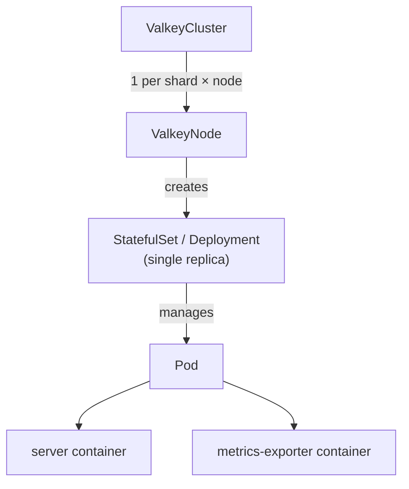

# ValkeyCluster

`ValkeyCluster` deploys Valkey in [Cluster mode](https://valkey.io/topics/cluster-tutorial/), handling:

- Topology scheduling
- Slot allocation
- Failovers
- Rolling updates
- ACLs

## Features

- [Config](#config)
- [Containers](#containers)
- [Metrics](#metrics)
- [Persistence](#persistence)
- [Scheduling](#scheduling)
- [TLS](#tls)
- [Users](#users)
- [Workload type](#workload-type)

### Config

```yaml
config:
  io-threads: 4
  maxmemory-policy: noeviction
```

Use `config` to pass [Valkey configuration](https://valkey.io/topics/valkey.conf/) to all nodes in the cluster.

#### Constraints

- Config changes require a manual restart
- Cluster management settings owned by the operator should not be overwritten

#### Future plans

- Config changes are automatically rolled out
  - Pods are not rolled for configs that can be applied live

### Containers

```yaml
containers:
  - name: server
    env:
      - name: MY_VAR
        value: "example"
  - name: my-sidecar
    image: busybox:latest
    command: ["sh", "-c", "sleep infinity"]
```

`containers` patches the pod's container list using strategic merge patch. Containers named `server` or `metrics-exporter` are merged by name; anything else is appended as a sidecar.

### Metrics

```yaml
exporter:
  enabled: true   # default
  image: oliver006/redis_exporter:v1.80.0
  resources:
    requests:
      memory: "64Mi"
      cpu: "50m"
```

Each pod runs a `metrics-exporter` sidecar by default, exposing Prometheus metrics on port `9121`. To disable it:

```yaml
exporter:
  enabled: false
```

### Persistence

```yaml
persistence:
  size: 10Gi
  storageClassName: gp3
  reclaimPolicy: Retain
```

When `persistence` is set, the operator manages a PVC for each ValkeyNode. With the [save config option](https://valkey.io/topics/persistence/), memory state survives pod rolls and [partial resyncs](https://valkey.io/topics/replication/) are possible.

`Retain` keeps the PVC when a ValkeyNode is deleted; `Delete` removes it.

#### Constraints

- Only supported with `workloadType: StatefulSet`
- Cannot be added or removed after creation
- Size can only grow
- `storageClassName` is immutable

#### Future plans

- Live volume expansion
- Automated volume expansion

### Scheduling

```yaml
tolerations:
  - key: "dedicated"
    operator: "Equal"
    value: "valkey"
    effect: "NoSchedule"
nodeSelector:
  kubernetes.io/arch: amd64
affinity:
  podAntiAffinity:
    requiredDuringSchedulingIgnoredDuringExecution:
      - labelSelector:
          matchLabels:
            app.kubernetes.io/name: valkey
        topologyKey: kubernetes.io/hostname
```

`tolerations`, `nodeSelector`, and `affinity` are passed through to every pod in the cluster.

### TLS

```yaml
tls:
  certificate:
    secretName: valkey-tls
```

`tls` enables TLS for all cluster communication. The Secret must contain:

| Key | Description |
|---|---|
| `ca.crt` | Certificate authority |
| `tls.crt` | Server certificate (or chain) |
| `tls.key` | Private key for the certificate |

### Users

```yaml
users:
  - name: alice
    passwordSecret:
      name: my-users-secret
      keys: [alicepw]
    commands:
      allow: ["@read", "@write", "@connection"]
      deny: ["@admin", "@dangerous"]
    keys:
      readWrite: ["app:*"]
      readOnly: ["shared:*"]
    channels:
      patterns: ["notifications:*"]
  - name: bob
    nopass: true
    permissions: "+@all ~* &*"
```

`users` defines per-user [ACL rules](https://valkey.io/topics/acl/) distributed to every node via a Secret mounted into each pod.

- `passwordSecret` — one or more password keys from a Secret (multiple keys supported for rotation)
- `commands` — command categories (`@read`, `@write`, `@admin`, etc.), individual commands, and subcommands to allow or deny
- `keys` — key patterns by access type: `readWrite`, `readOnly`, `writeOnly`
- `channels` — pub/sub channel patterns
- `permissions` — raw ACL string appended after any generated rules

#### Constraints

- Usernames cannot start with `_` (reserved for operator-managed system users)

### Workload type

```yaml
workloadType: StatefulSet  # default
```

`workloadType` controls whether ValkeyNodes use a `StatefulSet` or a `Deployment`. Use `Deployment` for cache-only clusters where you don't need persistent storage or stable pod identity.

#### Constraints

- Immutable after creation
- `persistence` requires `workloadType: StatefulSet`

## Architecture

`ValkeyCluster` creates a `ValkeyNode` for each shard/replica position. The `ValkeyNode` controller owns the underlying `StatefulSet` or `Deployment` and its single pod.



`ValkeyNode` is an internal CRD — do not create or modify ValkeyNodes directly. All configuration goes through `ValkeyCluster`. See [ValkeyNode design](./valkeynode-design.md) for why this abstraction exists.

For status conditions and events, see [status-conditions.md](./status-conditions.md).
