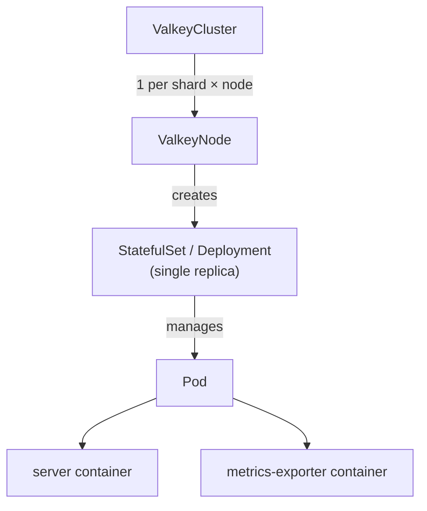

# ValkeyCluster

`ValkeyCluster` deploys Valkey in [Cluster mode](https://valkey.io/topics/cluster-tutorial/), handling:

- Topology scheduling
- Slot allocation
- Failovers
- Rolling updates
- ACLs

## Features

- [Config](#config)
- [Containers](#containers)
- [Metrics](#metrics)
- [Persistence](#persistence)
- [Pod disruption budget](#pod-disruption-budget)
- [Private image registries](#private-image-registries)
- [Scheduling](#scheduling)
- [TLS](#tls)
- [Users](#users)
- [Workload type](#workload-type)

### Config

```yaml
config:
  io-threads: 4
  maxmemory-policy: noeviction
```

Use `config` to pass [Valkey configuration](https://valkey.io/topics/valkey.conf/) to all nodes in the cluster.

Listed below are configurations can be applied live without rolling pods. We are adopting configs that can be applied live on a case-by-case basis. For any requests please [raise an issue](https://github.com/valkey-io/valkey-operator/issues/new).

```
maxclients
maxmemory         # There are no safeguards, ensure you do not exceed your container capacity
maxmemory-policy
```

#### Constraints

- Cluster management settings owned by the operator cannot be overwritten

#### Future plans

- Operator validates configs before they are applied to the server
  - https://github.com/valkey-io/valkey-operator/issues/141#issuecomment-4269559003

### Containers

```yaml
containers:
  - name: server
    env:
      - name: MY_VAR
        value: "example"
  - name: my-sidecar
    image: busybox:latest
    command: ["sh", "-c", "sleep infinity"]
```

`containers` patches the pod's container list using strategic merge patch. Containers named `server` or `metrics-exporter` are merged by name; anything else is appended as a sidecar.

### Metrics

```yaml
exporter:
  enabled: true   # default
  image: oliver006/redis_exporter:v1.80.0
  args: # optional command-line flags for exporter
    - -ping-on-connect
  resources:
    requests:
      memory: "64Mi"
      cpu: "50m"
```

NOTE: `oliver006/redis_exporter` command-line arguments have higher priority than the environment variables passed by default, so `exporter.args` can override them when needed.

Each pod runs a `metrics-exporter` sidecar by default, exposing Prometheus metrics on port `9121`. To disable it:

```yaml
exporter:
  enabled: false
```

### Persistence

```yaml
persistence:
  size: 10Gi
  storageClassName: gp3
  reclaimPolicy: Retain
```

When `persistence` is set, the operator manages a PVC for each ValkeyNode. With the [save config option](https://valkey.io/topics/persistence/), memory state survives pod rolls and [partial resyncs](https://valkey.io/topics/replication/) are possible.

`Retain` keeps the PVC when a ValkeyNode is deleted; `Delete` removes it.

#### Constraints

- Only supported with `workloadType: StatefulSet`
- Cannot be added or removed after creation
- Size can only grow
- `storageClassName` is immutable

#### Future plans

- Live volume expansion
- Automated volume expansion

### Pod disruption budget

```yaml
podDisruptionBudget:
  mode: Cluster  # default
```

The operator creates a `PodDisruptionBudget` with `maxUnavailable: 1` selecting all pods in the cluster. Set `mode: Disabled` when the PDB is managed externally or is not required. Omitting `podDisruptionBudget` entirely is equivalent to `mode: Cluster`.

| Mode | Behaviour |
|---|---|
| `Cluster` | Operator creates and owns a single cluster-wide PDB |
| `Disabled` | Operator deletes the PDB if it exists and does not recreate it |

### Graceful shutdown

On `SIGTERM` (a node drain, eviction, or preemption), a cluster primary fails its slots over to a replica before exiting, so descheduling a primary the operator did not initiate does not leave the shard without a writer. This is enabled by default through the `shutdown-on-sigterm failover` server config and requires Valkey 9.0+.

The handoff runs inside the pod's termination grace period. With defaults there is comfortable margin: the Kubernetes default `terminationGracePeriodSeconds` is 30s and the Valkey default `cluster-manual-failover-timeout` is 5s, so the failover completes well before `SIGKILL`. If you raise `cluster-manual-failover-timeout`, the operator raises the derived `terminationGracePeriodSeconds` to match; see [Termination grace period](#termination-grace-period).

### Termination grace period

```yaml
terminationGracePeriodSeconds: 60
```

`terminationGracePeriodSeconds` sets the pod termination grace period for the Valkey nodes. On `SIGTERM` a primary gracefully fails its slots over to a replica, and that handover has to finish before Kubernetes sends `SIGKILL`, so the grace period must be at least `cluster-manual-failover-timeout` plus some headroom.

When omitted, the operator picks a safe value: the larger of the Kubernetes default (30s) and `cluster-manual-failover-timeout` (default 5s) plus a 10s buffer. With defaults that stays at 30s. Raising `cluster-manual-failover-timeout` pulls the derived grace period up with it.

An explicit value is honoured as-is, even if it is below the recommended minimum. In that case the operator sets a `ConfigurationWarning` condition (reason `GracePeriodTooShort`) on the `ValkeyCluster` and emits an event when the cluster first enters that state, rather than silently overriding the value. The value must be a positive integer; the CRD rejects zero or negative values.

### Private image registries

```yaml
image: registry.example.com/valkey/valkey:9.0.0
imagePullSecrets:
  - name: registrycredential
```

`imagePullSecrets` is a list of `Secret` references (in the cluster's namespace) used to pull images from private registries. It is applied at the pod level, so a single list covers every image in the pod - the Valkey server, the metrics exporter sidecar, and any additional containers. It is optional and has no default; omit it when the nodes already authenticate to the registry.

### Scheduling

```yaml
scheduling:
  tolerations:
    - key: "dedicated"
      operator: "Equal"
      value: "valkey"
      effect: "NoSchedule"
  nodeSelector:
    kubernetes.io/arch: amd64
  affinity:
    podAntiAffinity:
      requiredDuringSchedulingIgnoredDuringExecution:
        - labelSelector:
            matchLabels:
              app.kubernetes.io/name: valkey
          topologyKey: kubernetes.io/hostname
  priorityClassName: high-priority
```

`scheduling.tolerations`, `scheduling.nodeSelector`, `scheduling.affinity`, and `scheduling.priorityClassName` are passed through to every pod in the cluster (`scheduling.nodeSelector` also carries the curated zone entry when [`zone.pinning`](#zone-axis-pinning) is set, see below). `priorityClassName` must reference an existing [PriorityClass](https://kubernetes.io/docs/concepts/scheduling-eviction/pod-priority-preemption/) and protects the Valkey pods from eviction under resource pressure.

#### Topology spread constraints

`topologySpreadConstraints` is a raw escape hatch: whatever you set is rendered **verbatim** onto every Valkey pod in the cluster. The operator does not scope, augment, or shard-index it, and adds no constraints of its own by default.

> **You must supply your own `labelSelector`.** A topology spread constraint with no `labelSelector` matches *nothing* — Kubernetes counts zero pods and the constraint enforces nothing (a silent no-op).
>
> Set a `labelSelector` that selects the pods you want counted; `valkey.io/cluster: <cluster-name>` selects every pod in the cluster.

For the common intents such as keep a shard's pods on different nodes, spread each shard's primary across nodes, or spread all pods across nodes — prefer [`scheduling.node.spread`](#node-axis-spread) below, and for the zone equivalents prefer [`scheduling.zone.spread`](#zone-axis-spread) or, to pin each pod to a specific zone rather than balance it, [`scheduling.zone.pinning`](#zone-axis-pinning). These fill in the correct label selectors for you and guarantee the constraints they emit don't collide. Reach for `topologySpreadConstraints` only when you need something neither axis expresses, such as a topology key other than `kubernetes.io/hostname` or `topology.kubernetes.io/zone`.

> **Do not overlap a hostname or zone constraint with `node.spread`/`zone.spread`.**
>
> A passthrough constraint on `topologyKey: kubernetes.io/hostname` collides with an enabled `node.spread.primaries` or `node.spread.pods` that renders the same `whenUnsatisfiable` (`Required` → `DoNotSchedule`, `Preferred` → `ScheduleAnyway`), because the pod would carry two constraints sharing that `{topologyKey, whenUnsatisfiable}` pair — which Kubernetes forbids. The same is true on `topologyKey: topology.kubernetes.io/zone`: a passthrough constraint there collides with an enabled `zone.spread.shard`, `zone.spread.primaries`, or `zone.spread.pods` of matching `whenUnsatisfiable`.
>
> The operator rejects both combinations at admission, so keep hostname spreading in `node.spread`, keep zone spreading in `zone.spread`, and reserve `topologySpreadConstraints` for other topology keys. A passthrough constraint whose `whenUnsatisfiable` differs from what the enabled dimensions render is still allowed.

Each constraint must include:

| Field | Meaning |
|---|---|
| `maxSkew` | Maximum allowed difference in matching pod count between topology domains. `1` means Kubernetes keeps the matching pods as evenly spread as possible. |
| `topologyKey` | Node label used as the spread domain. Use `kubernetes.io/hostname` for worker-node spreading, or labels such as `topology.kubernetes.io/zone` for zone spreading. |
| `labelSelector` | Which pods to count. Required for the constraint to do anything (see note above). |
| `whenUnsatisfiable` | What Kubernetes should do when the constraint cannot be satisfied. |

`whenUnsatisfiable` supports:

| Value | Behaviour | Impact |
|---|---|---|
| `DoNotSchedule` | Hard rule. Kubernetes will not schedule the pod if placement would violate the constraint. | Stronger placement guarantees, but pods may remain `Pending` when there are not enough eligible nodes or topology domains. The operator marks the cluster `Degraded` with reason `PodUnschedulable`. |
| `ScheduleAnyway` | Soft rule. Kubernetes prefers satisfying the constraint, but can still schedule the pod if it cannot. | Better scheduling availability in constrained clusters, but matching pods may still share a topology domain. |

Example — spread pods across rack failure domains, a topology that neither `node.spread` nor `zone.spread` expresses (your nodes must carry the label):

```yaml
scheduling:
  topologySpreadConstraints:
    - maxSkew: 1
      topologyKey: topology.example.com/rack   # a custom node label; neither node.spread nor zone.spread covers it
      whenUnsatisfiable: ScheduleAnyway
      labelSelector:
        matchLabels:
          valkey.io/cluster: my-cluster
```

Switch `whenUnsatisfiable` to `DoNotSchedule` to make it a hard rule; pods that cannot be placed within `maxSkew` then stay `Pending` rather than colocating.

#### Node axis spread

```yaml
scheduling:
  node:
    spread:
      shard:
        mode: Preferred
      primaries:
        mode: Disabled
      pods:
        mode: Disabled
```

`scheduling.node.spread` groups three independent spread dimensions, each keyed on `kubernetes.io/hostname`, so you get shard- and primary-aware placement without hand-writing label selectors:

| Field | Rendered as | Effect |
|---|---|---|
| `shard` | Pod anti-affinity | Keeps pods belonging to the same shard, for example a primary and its replica, off the same node. |
| `primaries` | Topology spread constraint on each shard's node-index-0 pod | Spreads the pod that holds each shard's primary (at creation) across nodes. |
| `pods` | Topology spread constraint on every cluster pod | Spreads all of the cluster's pods across nodes, regardless of shard. |

Each field takes a `mode`:

| Mode | Behaviour |
|---|---|
| `Disabled` | Emits nothing for that dimension. This is the default for all three fields. |
| `Preferred` | Soft rule: a `preferredDuringSchedulingIgnoredDuringExecution` anti-affinity term (`shard`), or a topology spread constraint with `whenUnsatisfiable: ScheduleAnyway` (`primaries`, `pods`). Kubernetes biases placement but never leaves a pod `Pending` because of it. |
| `Required` | Hard rule: a `requiredDuringSchedulingIgnoredDuringExecution` anti-affinity term (`shard`), or a topology spread constraint with `whenUnsatisfiable: DoNotSchedule` (`primaries`, `pods`). A pod that cannot satisfy the rule stays `Pending`. |

> **`primaries` targets the primary at creation, not the live primary.**
>
> It keys its topology spread constraint on each shard's `node-index=0` pod. A topology spread constraint is only evaluated when a pod is scheduled and never re-evaluated on a running pod, so `primaries` deliberately targets this stable identity rather than a live primary-role label. After a failover the constraint keeps spreading the `node-index=0` pods, which may no longer be the primaries, until primary failback ([#311](https://github.com/valkey-io/valkey-operator/issues/311)) is implemented and realigns desired with actual. You should read `primaries: Required` as "spread the pods that start as primaries", not as a continuous guarantee that the current primaries sit on distinct nodes.
>
> This note will be removed once [#311](https://github.com/valkey-io/valkey-operator/issues/311) is implemented.

`shard`, `primaries`, and `pods` all default to `Disabled` when `node.spread`, `scheduling.node`, or `scheduling` itself is omitted. This is opt-in and matches today's behaviour, so an existing cluster that sets no scheduling constraints at all renders byte-identical pod specs after an operator upgrade — no fleet-wide rolling restart. A cluster that already sets `topologySpreadConstraints` is not covered by that guarantee: those constraints lose the old implicit shard-scoping under verbatim rendering (see above), so it gets a one-time re-render on upgrade even without touching `node.spread`. The trade-off is that nothing stops a shard's primary and replica from landing on the same node until you opt in. For production availability, set `shard` to at least `Preferred` so that losing a single node cannot take out every copy of a shard's data.

`primaries` and `pods` both render as topology spread constraints on `kubernetes.io/hostname`. Setting them to the same mode would produce two constraints of identical strength competing over the same domain, so the operator rejects the combination at admission:

- `primaries: Required` together with `pods: Required` is rejected.
- `primaries: Preferred` together with `pods: Preferred` is rejected.

Mixing strengths (one `Preferred`, the other `Required`), or leaving one of them `Disabled`, is always allowed. `shard` is exempt from this rule since it renders as pod anti-affinity rather than a topology spread constraint, so it can be combined freely with any `primaries`/`pods` setting.

#### Zone axis spread

```yaml
scheduling:
  zone:
    spread:
      shard:
        mode: Preferred
```

`scheduling.zone.spread` mirrors `node.spread`'s three dimensions, but keyed on `topology.kubernetes.io/zone` instead of `kubernetes.io/hostname`:

| Field | Rendered as | Effect |
|---|---|---|
| `shard` | Topology spread constraint scoped to each shard's pods | Balances a shard's pods across zones. |
| `primaries` | Topology spread constraint on each shard's node-index-0 pod | Balances the pod that holds each shard's primary (at creation) across zones. |
| `pods` | Topology spread constraint on every cluster pod | Balances all of the cluster's pods across zones, regardless of shard. |

On the node axis, `shard` renders as pod anti-affinity: a hard `Required` setting can leave pods `Pending` rather than colocate them. On the zone axis, `shard` is a topology spread constraint instead, because forbidding same-zone placement outright would make a shard unschedulable in any cluster with fewer zones than shard members. So zone `shard` balances rather than forbids: it keeps a shard's replicas as evenly spread across zones as `maxSkew` allows, but two members of the same shard may still land in the same zone once the shard is larger than the number of available zones.

Each field takes the same `Disabled` / `Preferred` / `Required` modes as `node.spread`, with the same soft/hard semantics. All three default to `Disabled` when `zone.spread`, `scheduling.zone`, or `scheduling` itself is omitted, so the zone axis is opt-in and emits nothing until you enable it.

`shard`, `primaries`, and `pods` all render as topology spread constraints on `topology.kubernetes.io/zone`. On the node axis `shard` is exempt from the slot limit because it renders as anti-affinity, but on the zone axis all three dimensions compete for the same two slots (`DoNotSchedule` and `ScheduleAnyway`) per zone. The operator rejects any combination where more than one of the three is `Required`, or more than one is `Preferred`, at admission; leaving at least two of the three `Disabled` (as in the sample above, which enables only `shard`) is the common case.

The zone axis is independent of the node axis. `node.spread` and `zone.spread` key on different topology keys, so a cluster can enable both at once, for example `node.spread.shard: Required` alongside `zone.spread.shard: Preferred`, to keep shard members off the same node while also biasing them across zones.

> **Zone `primaries` is placement-time, not maintained**
>
> As on the node axis, `zone.spread.primaries` constrains each shard's `node-index=0` pod — the primary *at creation*, not the live primary. The constraint is evaluated only when a pod is scheduled, so after a failover the promoted primary can sit at `node-index>0` in whatever zone it landed; the spread then reflects where primaries were *placed*, not where they currently are, until primary failback ([#311](https://github.com/valkey-io/valkey-operator/issues/311)) realigns them. Read it as "spread the pods that start as primaries" and not a live guarantee.

> **Cross-zone spreading has a cost**
>
> Placing a shard's primary and replicas in different availability zones means every replicated write crosses a zone boundary; adding write latency and inter-zone data-transfer cost (if applicable). It is usually the right trade for availability (a single zone outage cannot take out a whole shard), but it is not free, consider the trade-off before applying.

#### Zone axis pinning

```yaml
scheduling:
  zone:
    pinning:
      zones:
        - eu-west-1a
        - eu-west-1b
        - eu-west-1c
```

Where `zone.spread` asks the scheduler to balance pods across zones, `zone.pinning` decides each pod's zone outright. A pod's zone is `zones[(shardIndex + nodeIndex) % len(zones)]`, rendered as a `topology.kubernetes.io/zone` entry in the pod's `nodeSelector`. For 3 shards with 1 replica each and the three zones above:

| ValkeyNode | Shard | Node index | Role at creation | Zone |
|---|---|---|---|---|
| `cluster-0-0` | 0 | 0 | primary | `eu-west-1a` |
| `cluster-0-1` | 0 | 1 | replica | `eu-west-1b` |
| `cluster-1-0` | 1 | 0 | primary | `eu-west-1b` |
| `cluster-1-1` | 1 | 1 | replica | `eu-west-1c` |
| `cluster-2-0` | 2 | 0 | primary | `eu-west-1c` |
| `cluster-2-1` | 2 | 1 | replica | `eu-west-1a` |

While there are at least as many zones as shards, primaries land in distinct zones as a side effect of the modulo rather than as an enforced property; once shards exceed the zone count, primaries repeat zones too (with 6 shards over 3 zones, shards 0 and 3 share a zone). When a shard has more members than there are zones, some of them necessarily share one. Adding shards or replicas never moves an existing pod, because a pod's indices do not change.

The zone list is **immutable while pinning is set**, because changing it reassigns nearly every pod at once. To change the sequence, remove `pinning`, let the cluster reconcile, then re-add it with the new list. On a cluster with persistence this is not a routine change: re-adding a different list has the same effect as adding pinning for the first time, so read the persistence note below first. Entries must be unique — a repeated zone silently skews the round-robin. The list holds at most 32 entries, each at most 63 characters (the Kubernetes label-value limit, which zone values must satisfy anyway). Pinning also cannot be combined with any non-`Disabled` `zone.spread` dimension, since pinning already fixes every pod's zone. All of this is rejected at admission.

Pinning renders the `topology.kubernetes.io/zone` key itself, so `scheduling.nodeSelector` may not also set that key; the operator rejects the combination rather than silently overwriting your value. Your `scheduling.affinity` is left untouched — Kubernetes ANDs `nodeSelector` with `nodeAffinity`, so a node must satisfy both. The node axis is independent: `node.spread.*` keys on `kubernetes.io/hostname` and composes with pinning freely.

If a pod cannot be placed in its pinned zone — no capacity, a `nodeSelector`/`affinity` that contradicts the pin, or a passthrough `topologySpreadConstraints` entry on `topology.kubernetes.io/zone` that the pinned distribution cannot satisfy (pinning spreads pods unevenly whenever `shards × (replicas+1)` is not a multiple of `len(zones)`, which can make a `maxSkew: 1` / `DoNotSchedule` zone constraint unsatisfiable) — it stays `Pending` and the operator marks the cluster `Degraded` with reason `PodUnschedulable`.

> **With persistence, pin at creation time**
>
> Persistent volumes are zonal on the major clouds, and a volume cannot follow a pod to another zone. Two consequences:
>
> - Your StorageClass must use `volumeBindingMode: WaitForFirstConsumer` (the default for the cloud CSI drivers) so the volume is provisioned *after* the scheduler places the pod. With `Immediate`, volumes are provisioned in arbitrary zones before scheduling and pinning cannot work at all, even on a new cluster.
> - Adding `pinning` to an existing persistent cluster will strand every pod whose volume sits in a different zone than the modulo assigns: the pod stays `Pending` and the operator marks the cluster `Degraded` with reason `PodUnschedulable`. The operator cannot detect this at admission, because it does not know where your volumes are.
>
> **To recover, remove `pinning`.** Each pod reschedules onto its existing volume's zone and the cluster returns to health with no data loss.
>
> If you instead want to migrate a live persistent cluster into its pinned zones, the volumes have to be recreated, which is destructive and must be done per shard: recycle one replica's PVC and pod at a time and let it re-sync from its primary, then fail over onto a re-synced replica, then recycle the old primary's PVC and pod. **A shard with no replicas cannot be migrated this way** — deleting its only volume destroys that shard's keyspace and the slots it owns. Note also that the operator sets `persistentVolumeClaimRetentionPolicy: Retain`, so the old volumes are never reclaimed for you and will keep costing money until you delete them, and that failing over leaves each shard's primary away from `node-index=0` until primary failback ([#311](https://github.com/valkey-io/valkey-operator/issues/311)) lands.
>
> A milder form of this applies to `zone.spread.*` set to `Required`: a recreated pod can be pushed away from its volume's zone.

### TLS

```yaml
networking:
  tls:
    certificate:
      secretName: valkey-tls
```

`networking.tls` enables TLS for all cluster communication. When set, `certificate.secretName` is required. The Secret must contain:

| Key | Description |
|---|---|
| `ca.crt` | Certificate authority |
| `tls.crt` | Server certificate (or chain) |
| `tls.key` | Private key for the certificate |

> **Breaking (alpha):** top-level `spec.tls` is removed in favour of `spec.networking.tls`.
>
> **Upgrade order:** move every ValkeyCluster to `spec.networking.tls` **before** rolling the new CRD. If you upgrade with only top-level `spec.tls` still set, the API server drops the unknown field and the cluster comes back up **with TLS off** (plaintext). That is not a silent field rename; migrate first, then CRD/operator.

### Users

```yaml
users:
  - name: alice
    passwordSecret:
      name: my-users-secret
      keys: [alicepw]
    commands:
      allow: ["@read", "@write", "@connection"]
      deny: ["@admin", "@dangerous"]
    keys:
      readWrite: ["app:*"]
      readOnly: ["shared:*"]
    channels:
      patterns: ["notifications:*"]
  - name: bob
    nopass: true
    permissions: "+@all ~* &*"
```

`users` defines per-user [ACL rules](https://valkey.io/topics/acl/) distributed to every node via a Secret mounted into each pod.

- `passwordSecret` — one or more password keys from a Secret (multiple keys supported for rotation)
- `commands` — command categories (`@read`, `@write`, `@admin`, etc.), individual commands, and subcommands to allow or deny
- `keys` — key patterns by access type: `readWrite`, `readOnly`, `writeOnly`
- `channels` — pub/sub channel patterns
- `permissions` — raw ACL string appended after any generated rules

ACL changes are applied to running nodes with `ACL LOAD` (no pod restart), the same way live-settable config is applied without rolling pods. Each node reports an [`ACLApplied`](status-conditions.md#aclapplied) condition once the change is live on the server.

> **Upgrade note:** Live application relies on the operator's `_operator` user holding the `acl|load`, `acl|getuser`, and `acl|users` commands, which older operator versions did not grant. Upgrading onto this version rewrites the pod template (it drops a now-unused annotation), so every existing cluster rolls once and picks up the new grants on restart, after which ACL changes apply live. The exception is a cluster old enough to predate that annotation entirely: it gets no automatic roll, so it needs a one-time manual pod restart after the upgrade before live ACL applies.

#### Constraints

- Usernames cannot start with `_` (reserved for operator-managed system users)

### Workload type

```yaml
workloadType: StatefulSet  # default
```

`workloadType` controls whether ValkeyNodes use a `StatefulSet` or a `Deployment`. Use `Deployment` for cache-only clusters where you don't need persistent storage or stable pod identity.

#### Constraints

- Immutable after creation
- `persistence` requires `workloadType: StatefulSet`

## Architecture

`ValkeyCluster` creates a `ValkeyNode` for each shard/replica position. The `ValkeyNode` controller owns the underlying `StatefulSet` or `Deployment` and its single pod.


```mermaid
graph TD
    VC[ValkeyCluster]

    VC -->|"1 per shard × node"| VN[ValkeyNode]

    VN -->|creates| WL["StatefulSet / Deployment\n(single replica)"]
    WL -->|manages| P[Pod]

    P --> S[server container]
    P --> E[metrics-exporter container]
```

`ValkeyNode` is an internal CRD — do not create or modify ValkeyNodes directly. All configuration goes through `ValkeyCluster`. See [ValkeyNode design](./valkeynode-design.md) for why this abstraction exists.

For status conditions and events, see [status-conditions.md](./status-conditions.md).
